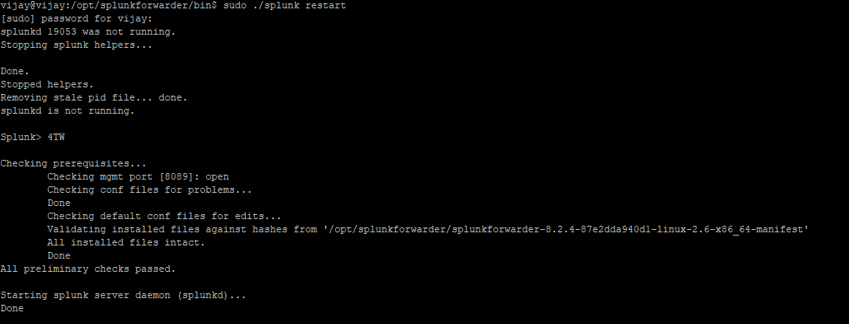
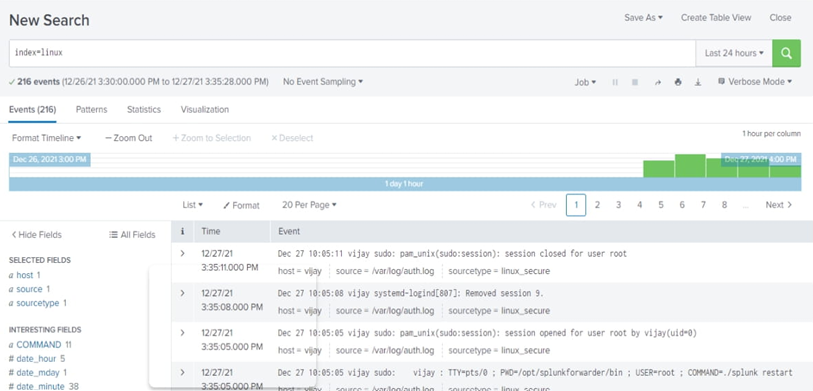

Project Overview

The goal is to send Linux system logs (such as /var/log/auth.log) to a Splunk Enterprise instance for monitoring and analysis.

This includes:

Installing the Splunk Universal Forwarder

Configuring inputs (log sources)

Configuring outputs (Splunk receiver)

Verifying ingestion in Splunk using SPL

Repository Structure
Splunk-Log-Forwarding/
│
├── screenshots/                     # Optional images of configuration and results
│
├── Configuring_Linux_to_Forward_Logs_to_Splunk.pdf   # Full lab document
│
└── README.md

Steps Performed
1. Linux Setup

Installed Ubuntu Server in a virtual machine

Enabled SSH

Configured UFW firewall rules

2. Install Splunk Universal Forwarder

Example commands:

dpkg -i splunkforwarder.deb
/opt/splunkforwarder/bin/splunk start --accept-license

3. Configure Log Forwarding
inputs.conf
[monitor:///var/log/auth.log]
index = linux
sourcetype = linux:auth

outputs.conf
[tcpout]
defaultGroup = default-autolb-group

[tcpout:default-autolb-group]
server = <Splunk_Server_IP>:9997

4. Verify Logs in Splunk

Example SPL searches:

index=linux

index=* | dedup host source sourcetype | table host source sourcetype

If logs appear, forwarding is working correctly.

Screenshots (Optional)

Add only the meaningful ones:

Forwarder status

inputs.conf / outputs.conf

SPL search results in Splunk

Example (once you upload them):

### Forwarder Status

### Log Ingestion in Splunk

Notes

This is a small lab exercise that demonstrates basic Splunk data onboarding.
It is not a full project, but it provides hands-on experience with:

Splunk Universal Forwarder

inputs.conf and outputs.conf

Log pipeline verification

Basic SPL searching
